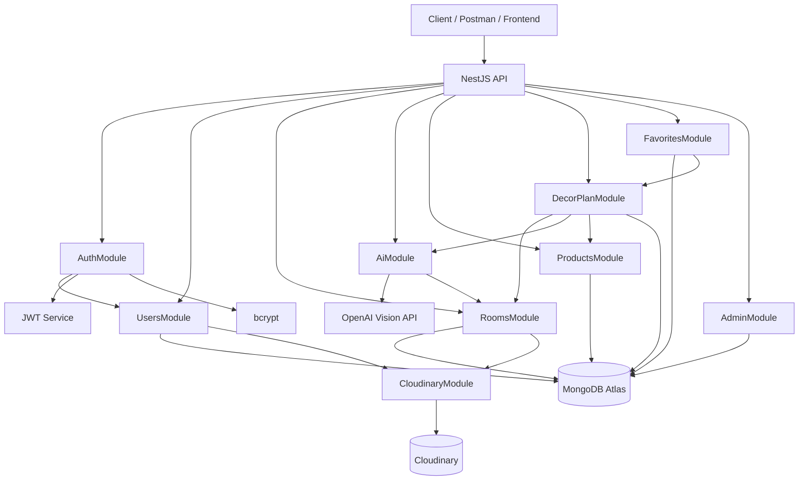
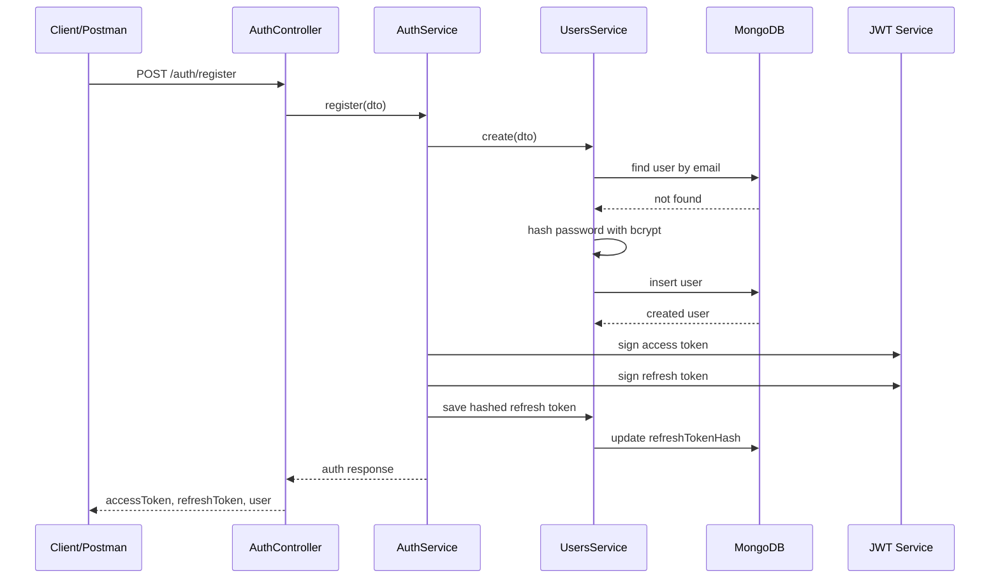
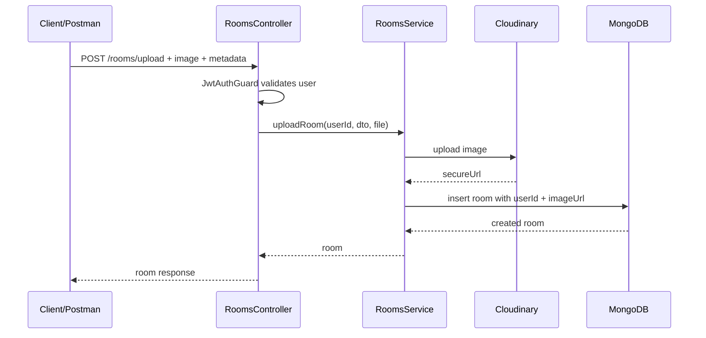
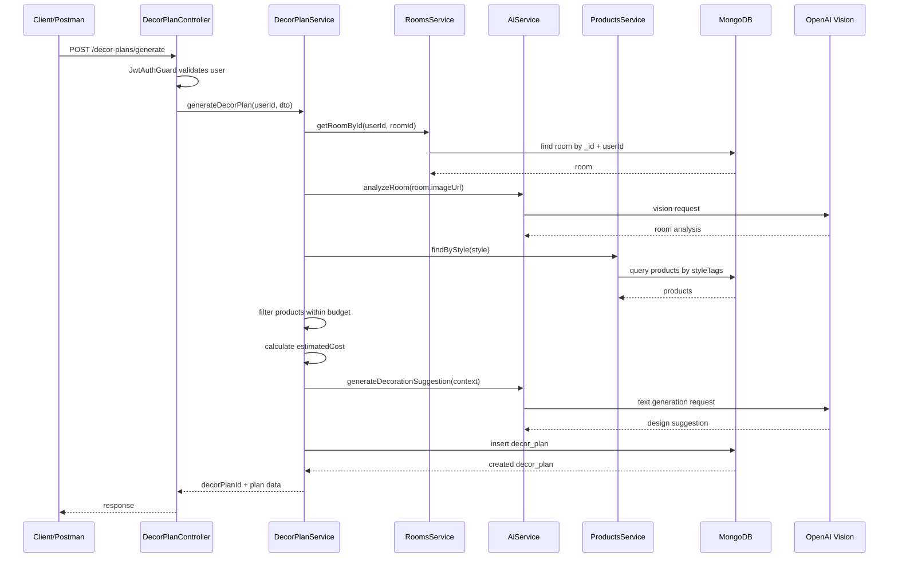
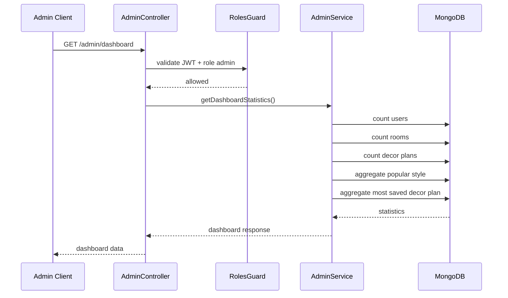
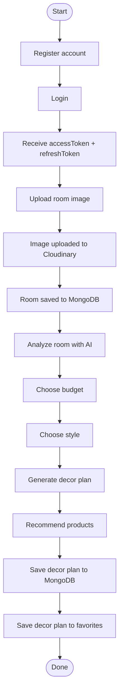
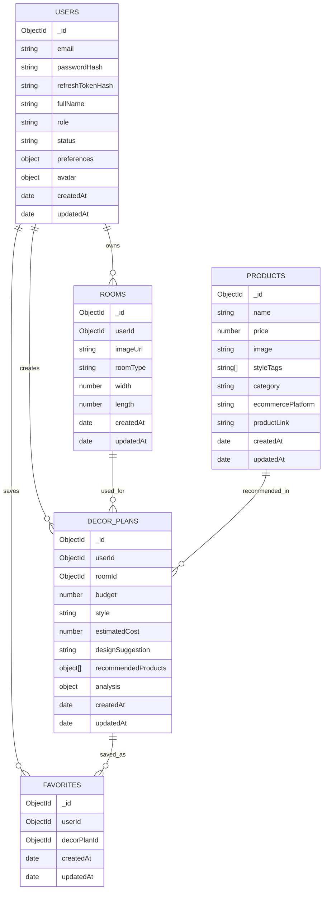

# DECOHO - Tài liệu luồng chạy Backend

## 1. Tổng quan dự án

DECOHO là backend cho hệ thống gợi ý trang trí nội thất bằng AI. Người dùng có thể đăng ký tài khoản, đăng nhập, upload ảnh phòng, để hệ thống AI phân tích ảnh, chọn ngân sách và phong cách, sau đó nhận một decor plan gồm gợi ý thiết kế, sản phẩm đề xuất và tổng chi phí ước tính.

Backend được xây dựng bằng:

- NestJS
- MongoDB Atlas
- Mongoose
- JWT Authentication
- Refresh Token
- bcrypt
- Cloudinary
- OpenAI Vision API
- Swagger
- Postman

Base URL mặc định:

```text
http://localhost:3000/api
```

Swagger URL:

```text
http://localhost:3000/api/docs
```

Postman collection:

```text
postman/DECOHO.postman_collection.json
```

## 2. Các vai trò trong hệ thống

DECOHO có 2 vai trò chính:

| Role | Mục đích |
| --- | --- |
| `user` | Người dùng thường: đăng ký, đăng nhập, upload phòng, tạo decor plan, lưu favorite |
| `admin` | Quản trị viên: tạo sản phẩm, xem dashboard analytics |

Phân quyền được xử lý bằng:

- `JwtAuthGuard`: kiểm tra access token hợp lệ.
- `RolesGuard`: kiểm tra role của người dùng.
- `@Roles(Role.ADMIN)`: đánh dấu API chỉ cho admin.

## 3. Kiến trúc module tổng thể

Các module chính:

| Module | Trách nhiệm |
| --- | --- |
| `AuthModule` | Đăng ký, đăng nhập, refresh token, logout, profile auth |
| `UsersModule` | Hồ sơ người dùng, avatar, cập nhật profile, xóa tài khoản |
| `RoomsModule` | Upload ảnh phòng, lưu thông tin phòng, lấy/xóa phòng theo user |
| `CloudinaryModule` | Upload và xóa ảnh trên Cloudinary |
| `AiModule` | Phân tích ảnh phòng bằng OpenAI Vision |
| `ProductsModule` | Quản lý catalog sản phẩm nội thất |
| `DecorPlanModule` | Tạo kế hoạch trang trí từ room + style + budget |
| `FavoritesModule` | Lưu/xóa/lấy decor plan yêu thích |
| `AdminModule` | Dashboard thống kê cho admin |

## 4. Sơ đồ phụ thuộc module



## 5. Luồng khởi động backend

Khi chạy backend:

```text
npm.cmd run start:dev
```

Luồng khởi động:

1. `main.ts` được chạy.
2. NestJS tạo app từ `AppModule`.
3. `.env` được load bằng `dotenv/config`.
4. App set global prefix:

```text
/api
```

5. CORS được bật để frontend/Postman có thể gọi API.
6. `ValidationPipe` được bật toàn cục:

| Option | Ý nghĩa |
| --- | --- |
| `whitelist: true` | Tự loại bỏ field không khai báo trong DTO |
| `forbidNonWhitelisted: true` | Báo lỗi nếu request gửi field lạ |
| `transform: true` | Tự convert kiểu dữ liệu theo DTO/pipe |

7. Swagger được setup tại:

```text
/api/docs
```

8. `AppModule` kết nối MongoDB Atlas bằng:

```text
MONGODB_URI
```

9. Các module được load:

```text
AuthModule
UsersModule
RoomsModule
AiModule
ProductsModule
DecorPlanModule
FavoritesModule
AdminModule
CloudinaryModule
```

10. Server listen ở port:

```text
PORT hoặc 3000
```

## 6. Luồng Authentication

### 6.1 Register

Endpoint:

```http
POST /api/auth/register
```

Request body:

```json
{
  "email": "decoho_user@example.com",
  "fullName": "Decoho User",
  "password": "Str0ngP@ssword!",
  "preferences": {
    "styles": ["minimalist", "modern"],
    "budgetMin": 1000000,
    "budgetMax": 5000000,
    "currency": "VND"
  }
}
```

Luồng xử lý:

1. Client gửi email, fullName, password và preferences.
2. `AuthController.register()` nhận request.
3. DTO validate dữ liệu đầu vào.
4. `AuthService.register()` gọi `UsersService.create()`.
5. `UsersService` kiểm tra email đã tồn tại chưa.
6. Password được hash bằng bcrypt.
7. User mới được lưu vào collection `users`.
8. `AuthService` tạo access token và refresh token.
9. Refresh token được hash rồi lưu vào field `refreshTokenHash`.
10. API trả về user public data và token pair.

Response chính:

```json
{
  "accessToken": "...",
  "refreshToken": "...",
  "user": {
    "id": "...",
    "email": "decoho_user@example.com",
    "fullName": "Decoho User",
    "role": "user",
    "status": "active"
  }
}
```

Sequence:



### 6.2 Login

Endpoint:

```http
POST /api/auth/login
```

Request body:

```json
{
  "email": "decoho_user@example.com",
  "password": "Str0ngP@ssword!"
}
```

Luồng xử lý:

1. Client gửi email và password.
2. `AuthService.login()` tìm user theo email.
3. Vì `passwordHash` bị `select: false`, service phải query có password hash.
4. bcrypt compare password gốc với passwordHash.
5. Nếu đúng, tạo access token và refresh token mới.
6. Refresh token mới được hash và ghi đè vào `refreshTokenHash`.
7. API trả về token pair và user data.

Lưu ý:

- Mỗi lần login sẽ rotate refresh token.
- Access token dùng cho các API cần đăng nhập.
- Refresh token dùng để xin access token mới.

### 6.3 Refresh Token

Endpoint:

```http
POST /api/auth/refresh
```

Authorization:

```text
Bearer <refreshToken>
```

Luồng xử lý:

1. Client gửi refresh token.
2. `RefreshTokenStrategy` đọc token từ `Authorization` header hoặc body.
3. Strategy verify token bằng `JWT_REFRESH_SECRET`.
4. `AuthService.refresh()` lấy user theo `sub` trong token.
5. bcrypt compare refresh token với `refreshTokenHash` trong database.
6. Nếu hợp lệ, hệ thống tạo access token và refresh token mới.
7. Refresh token mới tiếp tục được hash và lưu vào database.

Kết quả:

```json
{
  "accessToken": "...",
  "refreshToken": "...",
  "user": {
    "id": "...",
    "email": "...",
    "role": "user"
  }
}
```

### 6.4 Logout

Endpoint:

```http
POST /api/auth/logout
```

Authorization:

```text
Bearer <accessToken>
```

Luồng xử lý:

1. `JwtAuthGuard` kiểm tra access token.
2. `AuthService.logout()` xóa `refreshTokenHash`.
3. Refresh token cũ không còn dùng được nữa.
4. API trả về `204 No Content`.

## 7. Luồng Users

### 7.1 Get Profile

Endpoint:

```http
GET /api/users/me
```

Luồng xử lý:

1. Client gửi access token.
2. `JwtAuthGuard` verify token.
3. User ID được lấy từ `request.user.sub`.
4. `UsersService.getProfile()` tìm user theo ID.
5. API trả về profile.

### 7.2 Update Profile

Endpoint:

```http
PATCH /api/users/me
```

Request body ví dụ:

```json
{
  "fullName": "Decoho User Updated",
  "preferences": {
    "styles": ["modern", "minimalist"],
    "budgetMin": 1000000,
    "budgetMax": 7000000,
    "currency": "VND"
  }
}
```

Luồng xử lý:

1. User phải đăng nhập.
2. DTO validate payload.
3. Service update đúng document của user hiện tại.
4. API trả về user sau khi update.

### 7.3 Upload Avatar

Endpoint:

```http
PATCH /api/users/me/avatar
```

Body type:

```text
multipart/form-data
```

Field:

```text
avatar: file
```

Luồng xử lý:

1. User gửi file avatar.
2. `FileInterceptor('avatar')` nhận file.
3. `UsersService.uploadAvatar()` gọi `CloudinaryService.uploadImage()`.
4. Cloudinary trả về `publicId`, `secureUrl`, metadata.
5. User document được cập nhật field `avatar`.

### 7.4 Delete Account

Endpoint:

```http
DELETE /api/users/me
```

Luồng xử lý:

1. User phải đăng nhập.
2. Service soft delete tài khoản.
3. User status chuyển sang `deleted`.
4. Field `deletedAt` được set.
5. API trả về `204 No Content`.

## 8. Luồng Rooms

### 8.1 Upload Room

Endpoint:

```http
POST /api/rooms/upload
```

Authorization:

```text
Bearer <accessToken>
```

Body type:

```text
multipart/form-data
```

Fields:

| Field | Type | Bắt buộc | Ghi chú |
| --- | --- | --- | --- |
| `image` | file | Có | Ảnh phòng |
| `roomType` | string | Có | `bedroom`, `living_room`, `kitchen`, `bathroom`, `office`, `dining_room`, `other` |
| `width` | number | Có | Chiều rộng phòng |
| `length` | number | Có | Chiều dài phòng |

Luồng xử lý:

1. Client gửi access token và ảnh phòng.
2. `JwtAuthGuard` xác thực user.
3. `FileInterceptor('image')` nhận file ảnh.
4. `RoomsService.uploadRoom()` kiểm tra userId hợp lệ.
5. Ảnh được upload lên Cloudinary.
6. Cloudinary trả về `secureUrl`.
7. Room document được lưu vào collection `rooms`.
8. API trả về room vừa tạo.

Response chính:

```json
{
  "_id": "...",
  "userId": "...",
  "imageUrl": "https://res.cloudinary.com/.../room.jpg",
  "roomType": "living_room",
  "width": 4.5,
  "length": 6.2,
  "createdAt": "...",
  "updatedAt": "..."
}
```

Sequence:



### 8.2 Get My Rooms

Endpoint:

```http
GET /api/rooms
```

Luồng xử lý:

1. User gửi access token.
2. Service query `rooms` theo `userId`.
3. Chỉ trả về phòng của chính user hiện tại.
4. Kết quả sort mới nhất trước.

### 8.3 Get Room By ID

Endpoint:

```http
GET /api/rooms/:id
```

Luồng xử lý:

1. User gửi `roomId`.
2. Service kiểm tra `roomId` hợp lệ.
3. Query điều kiện:

```text
_id = roomId AND userId = currentUserId
```

4. Nếu room không thuộc user hiện tại, API trả `404`.

### 8.4 Delete Room

Endpoint:

```http
DELETE /api/rooms/:id
```

Luồng xử lý:

1. User gửi `roomId`.
2. Service chỉ xóa document thỏa:

```text
_id = roomId AND userId = currentUserId
```

3. User không thể xóa room của người khác.

## 9. Luồng AI Analysis

AI Module dùng OpenAI Vision API để phân tích ảnh phòng đã upload.

### 9.1 Analyze Room

Endpoint:

```http
POST /api/ai/rooms/:roomId/analyze
```

Luồng xử lý:

1. User gửi access token và `roomId`.
2. `AiController` không nhận ảnh trực tiếp.
3. Controller gọi `RoomsService.getRoomById(userId, roomId)`.
4. Nếu room thuộc user hiện tại, lấy `room.imageUrl`.
5. `AiService.analyzeRoom(imageUrl)` gửi ảnh sang OpenAI Vision API.
6. OpenAI trả về phân tích.
7. API trả về object chuẩn:

```json
{
  "roomType": "Bedroom",
  "detectedObjects": ["Bed", "Desk", "Lamp"],
  "colors": ["White", "Gray"]
}
```

### 9.2 Detect Objects

Endpoint:

```http
GET /api/ai/rooms/:roomId/objects
```

Kết quả:

```json
["Bed", "Desk", "Lamp"]
```

### 9.3 Detect Colors

Endpoint:

```http
GET /api/ai/rooms/:roomId/colors
```

Kết quả:

```json
["White", "Gray"]
```

### 9.4 Classify Room Type

Endpoint:

```http
GET /api/ai/rooms/:roomId/type
```

Kết quả:

```json
"Bedroom"
```

## 10. Luồng Products

Products là nguồn dữ liệu để Decor Plan chọn sản phẩm đề xuất.

### 10.1 Create Product

Endpoint:

```http
POST /api/products
```

Yêu cầu:

```text
Role ADMIN
```

Request body:

```json
{
  "name": "Minimalist Wooden Desk",
  "price": 4500000,
  "image": "https://res.cloudinary.com/decoho/image/upload/products/desk.jpg",
  "styleTags": ["minimalist", "modern", "workspace"],
  "category": "desk",
  "ecommercePlatform": "IKEA",
  "productLink": "https://www.ikea.com/example-product"
}
```

Luồng xử lý:

1. Admin đăng nhập để lấy access token.
2. `JwtAuthGuard` xác thực token.
3. `RolesGuard` kiểm tra role là `admin`.
4. DTO validate payload.
5. `ProductsService.create()` chuẩn hóa:

```text
category -> lowercase
styleTags -> lowercase
ecommercePlatform -> trim
```

6. Product được lưu vào collection `products`.

### 10.2 Get Products

Endpoint:

```http
GET /api/products
```

Đây là public API, không cần token.

### 10.3 Get Product By ID

Endpoint:

```http
GET /api/products/:id
```

### 10.4 Get Products By Style

Endpoint:

```http
GET /api/products/style/:style
```

Ví dụ:

```http
GET /api/products/style/Minimalist
```

Service sẽ normalize style thành lowercase để match `styleTags`.

### 10.5 Get Products By Budget

Endpoint:

```http
GET /api/products/budget/:amount
```

Ví dụ:

```http
GET /api/products/budget/5000000
```

Query logic:

```text
price <= amount
```

Sort:

```text
price ASC, createdAt DESC
```

## 11. Luồng Decor Plan

Đây là luồng quan trọng nhất của DECOHO.

### 11.1 Generate Decor Plan

Endpoint:

```http
POST /api/decor-plans/generate
```

Authorization:

```text
Bearer <accessToken>
```

Request body:

```json
{
  "roomId": "...",
  "budget": 5000000,
  "style": "Minimalist"
}
```

Style hợp lệ:

```text
Minimalist
Modern
Vintage
Luxury
Korean
```

Luồng xử lý chi tiết:

1. User upload room trước để có `roomId`.
2. User chọn budget.
3. User chọn style.
4. Client gọi `POST /api/decor-plans/generate`.
5. `JwtAuthGuard` xác thực user.
6. `DecorPlanService.generateDecorPlan()` kiểm tra `userId`.
7. Service gọi `RoomsService.getRoomById(userId, roomId)`.
8. Nếu room không thuộc user hiện tại, API trả `404`.
9. Lấy `room.imageUrl`.
10. Gọi `AiService.analyzeRoom(room.imageUrl)`.
11. AI trả về:

```json
{
  "roomType": "Bedroom",
  "detectedObjects": ["Bed", "Desk", "Lamp"],
  "colors": ["White", "Gray"]
}
```

12. Service gọi `ProductsService.findByStyle(style)`.
13. Product được lọc theo budget.
14. Nếu không có product đúng style, fallback sang `findByBudget(budget)`.
15. Service chọn tối đa 8 sản phẩm sao cho tổng không vượt budget.
16. Tính `estimatedCost`.
17. Gọi `AiService.generateDecorationSuggestion()` với:

```text
roomType
detectedObjects
colors
style
budget
estimatedCost
productNames
```

18. AI tạo nội dung gợi ý thiết kế.
19. Decor plan được lưu vào collection `decor_plans`.
20. API trả về `decorPlanId`, estimated cost, design suggestion và recommended products.

Response:

```json
{
  "decorPlanId": "...",
  "estimatedCost": 4500000,
  "designSuggestion": "Use a calm Minimalist layout with neutral colors and compact storage pieces.",
  "recommendedProducts": [
    {
      "productId": "...",
      "name": "Minimalist Wooden Desk",
      "price": 4500000,
      "image": "https://...",
      "category": "desk",
      "ecommercePlatform": "IKEA",
      "productLink": "https://...",
      "styleTags": ["minimalist", "modern"]
    }
  ]
}
```

Sequence:



## 12. Luồng Favorites

Favorites cho phép user lưu decor plan yêu thích.

### 12.1 Save Decor Plan

Endpoint:

```http
POST /api/favorites
```

Request body:

```json
{
  "decorPlanId": "..."
}
```

Luồng xử lý:

1. User phải đăng nhập.
2. `FavoritesService.saveDecorPlan()` validate `decorPlanId`.
3. Service kiểm tra decor plan có thuộc user hiện tại không.
4. Nếu không thuộc user, trả `404`.
5. Service kiểm tra user đã lưu decor plan này chưa.
6. Nếu đã lưu, trả `409 Conflict`.
7. Nếu chưa, tạo favorite document trong collection `favorites`.

### 12.2 Get Favorites

Endpoint:

```http
GET /api/favorites
```

Luồng xử lý:

1. User gửi access token.
2. Query `favorites` theo `userId`.
3. Populate `decorPlanId`.
4. Sort mới nhất trước.

### 12.3 Remove Favorite

Endpoint:

```http
DELETE /api/favorites/:id
```

Luồng xử lý:

1. User gửi favorite ID.
2. Service chỉ xóa favorite có:

```text
_id = favoriteId AND userId = currentUserId
```

3. User không thể xóa favorite của người khác.

## 13. Luồng Admin Dashboard

Endpoint:

```http
GET /api/admin/dashboard
```

Yêu cầu:

```text
Role ADMIN
```

Dashboard trả về:

| Field | Ý nghĩa |
| --- | --- |
| `totalUsers` | Tổng số user |
| `totalRooms` | Tổng số room |
| `totalDecorPlans` | Tổng số decor plan |
| `mostPopularStyle` | Style được dùng nhiều nhất |
| `mostSavedDecorPlan` | Decor plan được lưu favorite nhiều nhất |

Luồng xử lý:

1. Admin login để lấy access token.
2. Gọi `/api/admin/dashboard`.
3. `JwtAuthGuard` xác thực token.
4. `RolesGuard` kiểm tra role `admin`.
5. `AdminService` query/aggregate MongoDB.
6. API trả về thống kê.

Sequence:



## 14. Luồng dữ liệu end-to-end của user

Đây là luồng user đầy đủ từ lúc chưa có tài khoản đến khi lưu decor plan yêu thích.



Chi tiết theo API:

| Bước | API | Kết quả cần lấy |
| --- | --- | --- |
| 1 | `POST /api/auth/register` | `accessToken`, `refreshToken`, `userId` |
| 2 | `POST /api/auth/login` | `accessToken`, `refreshToken` |
| 3 | `POST /api/rooms/upload` | `roomId` |
| 4 | `POST /api/ai/rooms/:roomId/analyze` | `roomType`, `detectedObjects`, `colors` |
| 5 | `GET /api/products/style/:style` | Danh sách product |
| 6 | `POST /api/decor-plans/generate` | `decorPlanId`, `estimatedCost`, `recommendedProducts` |
| 7 | `POST /api/favorites` | `favoriteId` |
| 8 | `GET /api/favorites` | Danh sách favorite của user |

## 15. Luồng test bằng Postman

Postman collection đã được thiết kế thành một file duy nhất:

```text
postman/DECOHO.postman_collection.json
```

Các folder trong collection:

```text
01 Auth - Tokens
02 Users - Profile
03 Rooms - Data
04 AI - Analysis
05 Products - Data
06 Decor Plans - Data
07 Favorites - Data
08 Admin - Dashboard
```

### 15.1 Quy tắc chạy Postman

Nên chạy theo thứ tự:

1. `01 Auth - Tokens / Register`
2. `03 Rooms - Data / Upload Room`
3. `04 AI - Analysis / Analyze Room`
4. `05 Products - Data / Get Products`
5. `06 Decor Plans - Data / Generate Decor Plan`
6. `07 Favorites - Data / Save Decor Plan`
7. `07 Favorites - Data / Get Favorites`

Nếu cần test admin:

1. Tạo hoặc sửa một user có role `admin` trong MongoDB.
2. Chạy `01 Auth - Tokens / Admin Login`.
3. Chạy `05 Products - Data / Create Product - ADMIN`.
4. Chạy `08 Admin - Dashboard / Dashboard`.

### 15.2 Biến Postman tự lưu

Collection có script tự lấy data thật từ response và lưu vào variables:

| Variable | Lấy từ đâu |
| --- | --- |
| `accessToken` | Register/Login/Refresh |
| `refreshToken` | Register/Login/Refresh |
| `userId` | Register/Login response |
| `roomId` | Upload Room/Get Rooms/Get Room |
| `productId` | Create Product/Get Products/Get Product |
| `decorPlanId` | Generate Decor Plan/Get Favorites |
| `favoriteId` | Save Decor Plan/Get Favorites |
| `style` | Collection variable |
| `budget` | Collection variable |

Nhờ vậy bạn không cần copy ID thủ công giữa các request.

## 16. Collections trong MongoDB

### 16.1 `users`

Dữ liệu chính:

- `email`
- `passwordHash`
- `refreshTokenHash`
- `fullName`
- `avatar`
- `role`
- `status`
- `preferences`
- `lastLoginAt`
- `deletedAt`
- `createdAt`
- `updatedAt`

Index quan trọng:

- Unique index trên `email`
- Index theo `role`, `status`
- Index theo `status`, `createdAt`
- Partial index cho `deletedAt`

### 16.2 `rooms`

Dữ liệu chính:

- `userId`
- `imageUrl`
- `roomType`
- `width`
- `length`
- `createdAt`
- `updatedAt`

Index quan trọng:

- `userId`
- `userId + createdAt`
- `userId + roomType`

### 16.3 `products`

Dữ liệu chính:

- `name`
- `price`
- `image`
- `styleTags`
- `category`
- `ecommercePlatform`
- `productLink`
- `createdAt`
- `updatedAt`

Index quan trọng:

- `price`
- `category + price`
- `styleTags + price`
- Text index trên `name`, `category`, `styleTags`, `ecommercePlatform`

### 16.4 `decor_plans`

Dữ liệu chính:

- `userId`
- `roomId`
- `budget`
- `style`
- `estimatedCost`
- `designSuggestion`
- `recommendedProducts`
- `analysis`
- `createdAt`
- `updatedAt`

Index quan trọng:

- `userId`
- `roomId`
- `userId + createdAt`
- `roomId + createdAt`
- `style + estimatedCost`

### 16.5 `favorites`

Dữ liệu chính:

- `userId`
- `decorPlanId`
- `createdAt`
- `updatedAt`

Index quan trọng:

- `userId`
- `decorPlanId`
- `userId + createdAt`
- Unique index `userId + decorPlanId`

## 17. ERD đơn giản



## 18. Bảo mật và ownership

Các nguyên tắc bảo mật đang dùng:

### 18.1 Password

- Không lưu password gốc.
- Password được hash bằng bcrypt.
- `passwordHash` không được trả về response.
- Schema set `select: false` cho `passwordHash`.

### 18.2 Refresh Token

- Không lưu refresh token gốc.
- Refresh token được hash bằng bcrypt.
- Khi login/refresh sẽ rotate refresh token.
- Khi logout sẽ xóa `refreshTokenHash`.

### 18.3 JWT Access Token

- Access token dùng để gọi API protected.
- Payload chính gồm:

```json
{
  "sub": "userId",
  "email": "user@example.com",
  "role": "user"
}
```

### 18.4 User Ownership

Các module có kiểm tra ownership:

| Module | Cách kiểm tra |
| --- | --- |
| Rooms | Query `_id + userId` |
| AI | Lấy room bằng `_id + userId` trước khi phân tích |
| Decor Plans | Chỉ generate từ room thuộc user hiện tại |
| Favorites | Chỉ save decor plan thuộc user hiện tại |

### 18.5 Admin RBAC

Các API admin-only:

```http
POST /api/products
GET /api/admin/dashboard
```

Yêu cầu:

```text
JwtAuthGuard + RolesGuard + role admin
```

## 19. Biến môi trường quan trọng

File `.env` cần có các biến chính:

```text
PORT=3000
API_PREFIX=api
CORS_ORIGIN=http://localhost:3000,http://localhost:5173

MONGODB_URI=mongodb+srv://...

JWT_ACCESS_SECRET=...
JWT_REFRESH_SECRET=...
JWT_ACCESS_EXPIRES_IN=15m
JWT_REFRESH_EXPIRES_IN=7d
PASSWORD_SALT_ROUNDS=12

CLOUDINARY_CLOUD_NAME=...
CLOUDINARY_API_KEY=...
CLOUDINARY_API_SECRET=...
CLOUDINARY_FOLDER=decoho
CLOUDINARY_ROOMS_FOLDER=decoho/rooms

OPENAI_API_KEY=...
OPENAI_MODEL=gpt-5.5
```

Không commit `.env` lên Git.

## 20. Các lỗi thường gặp

### 20.1 Port đã được dùng

Lỗi:

```text
Error: listen EADDRINUSE: address already in use :::3000
```

Ý nghĩa:

```text
Đã có process khác đang chạy ở port 3000.
```

Cách xử lý trên Windows PowerShell:

```powershell
Get-NetTCPConnection -LocalPort 3000 | Select-Object LocalAddress,LocalPort,OwningProcess
Stop-Process -Id <PID>
```

Hoặc đổi port trong `.env`:

```text
PORT=3001
```

### 20.2 MongoDB không kết nối được

Kiểm tra:

- `MONGODB_URI` đúng chưa.
- IP hiện tại đã được whitelist trong MongoDB Atlas chưa.
- User/password Atlas đúng chưa.
- Network có cho phép kết nối ra ngoài không.

### 20.3 Upload ảnh lỗi

Kiểm tra:

- Cloudinary env có đủ chưa.
- Field trong Postman đúng là `image` cho room.
- Field trong Postman đúng là `avatar` cho avatar.
- Body type là `form-data`, không phải raw JSON.

### 20.4 AI lỗi

Kiểm tra:

- `OPENAI_API_KEY` đúng chưa.
- Model có hợp lệ không.
- Room có `imageUrl` public không.
- Cloudinary URL có truy cập được từ internet không.

### 20.5 401 Unauthorized

Nguyên nhân thường gặp:

- Chưa login.
- Access token hết hạn.
- Gửi nhầm refresh token vào API cần access token.
- Header thiếu:

```text
Authorization: Bearer <accessToken>
```

### 20.6 403 Forbidden

Nguyên nhân:

```text
User không có role admin.
```

Thường xảy ra khi gọi:

```http
POST /api/products
GET /api/admin/dashboard
```

## 21. Checklist chạy demo

Trước khi demo:

- `.env` đã có MongoDB URI.
- `.env` đã có JWT secrets.
- `.env` đã có Cloudinary config.
- `.env` đã có OpenAI API key nếu demo AI/decor plan thật.
- Server chạy không bị trùng port.
- MongoDB Atlas connect thành công.
- Import đúng Postman collection một file.
- Chạy Register/Login trước để lấy token.
- Upload room trước khi analyze/generate decor plan.
- Có product trong database trước khi generate decor plan nếu muốn có recommended products.
- Tài khoản admin có role `admin` nếu test admin/product create.

## 22. Luồng demo đề xuất

Demo user:

1. Register user.
2. Login user.
3. Get profile.
4. Upload room image.
5. Get rooms.
6. Analyze room.
7. Get products by style.
8. Generate decor plan.
9. Save decor plan to favorites.
10. Get favorites.

Demo admin:

1. Login admin.
2. Create product.
3. Get products.
4. Get dashboard.

## 23. Tóm tắt luồng chính

Luồng cốt lõi của DECOHO:

```text
User đăng ký/đăng nhập
-> Nhận JWT access token
-> Upload ảnh phòng
-> Ảnh được lưu trên Cloudinary
-> Room metadata được lưu trong MongoDB
-> AI phân tích ảnh phòng
-> User chọn style và budget
-> Hệ thống lọc products phù hợp
-> AI tạo gợi ý thiết kế
-> Decor plan được lưu vào MongoDB
-> User lưu decor plan vào favorites
-> Admin xem thống kê toàn hệ thống
```

Đây là flow backend hiện tại của DECOHO, bám theo code trong project và Postman collection hiện có.
